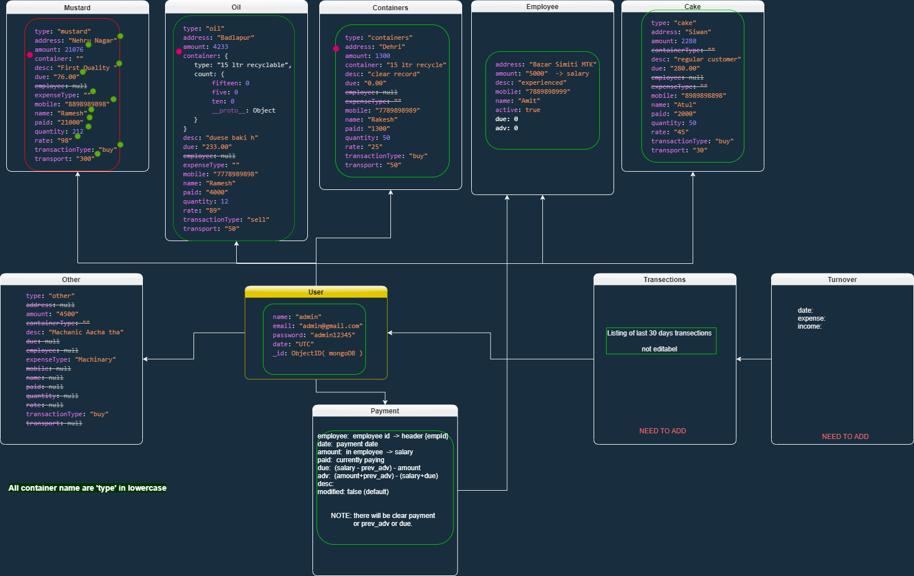
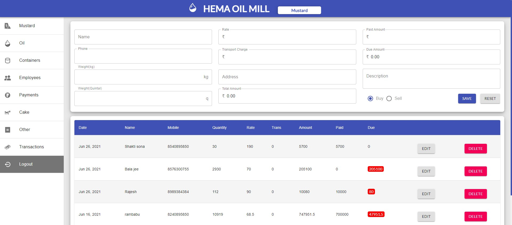

## Live

[Link to Live Project](https://boiling-taiga-85602.herokuapp.com/login)

## Schema:

## Screen Shots:

### Home:

### Oil Section:

### Payment Section:

## Dependencies:

    "bcryptjs": Encryption and Decryption of data
    "dotenv": Sensetive data like URI, Secret Key, etc
    "express": Server
    "express-validator": As Middleware
    "jsonwebtoken":  JWT, Algo - "HS256"
    "mongoose": Abstraction layer over MongoDB
